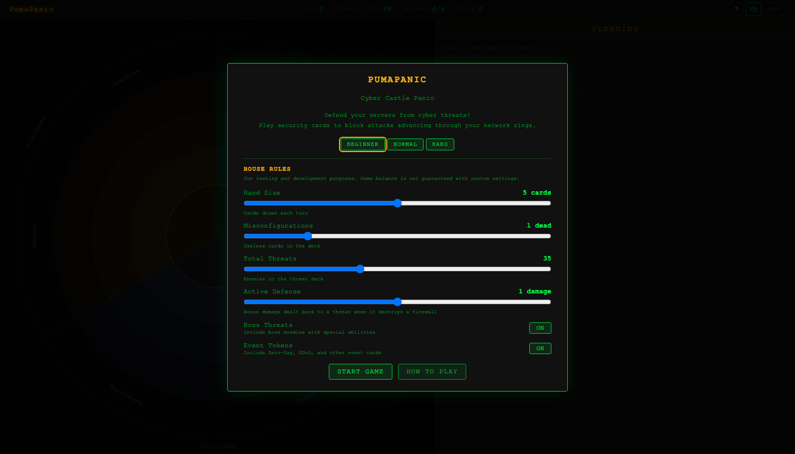
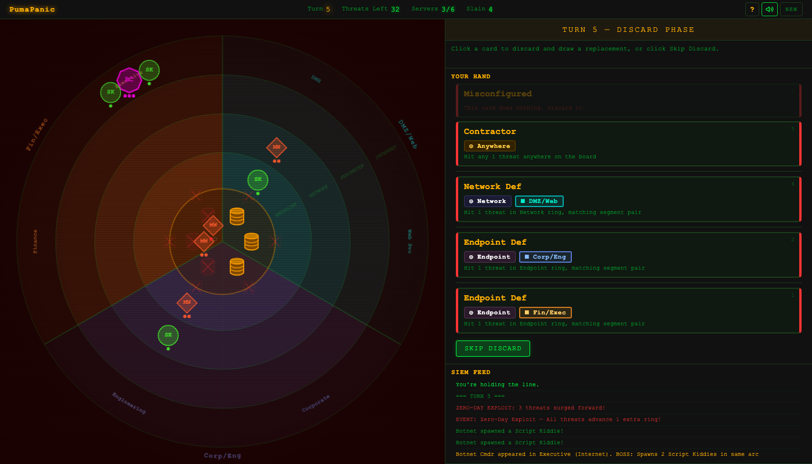
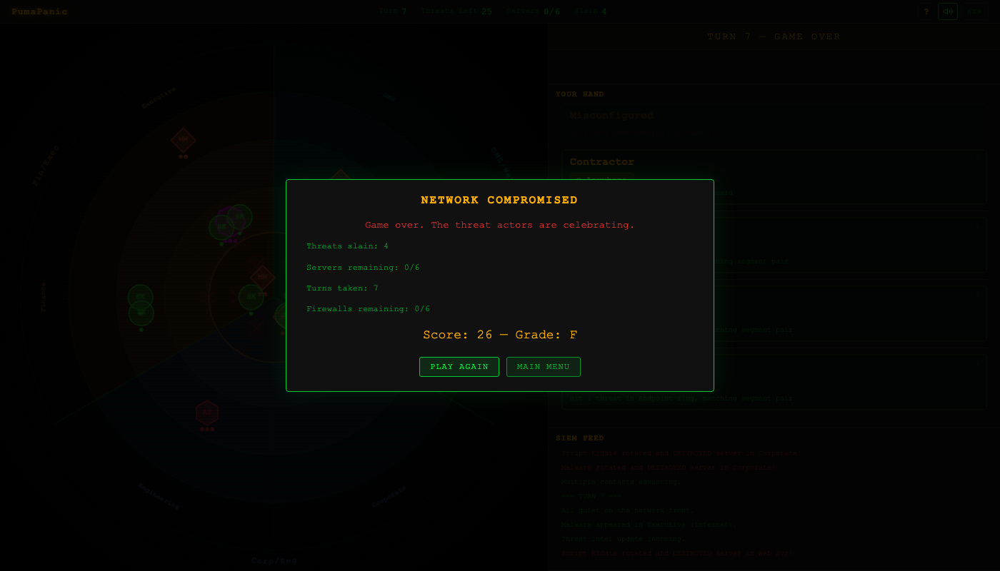

# PumaPanic

**Cyber Castle Panic** — A single-player turn-based card game where you defend your network from cyber threats.

Inspired by [Castle Panic](https://firesidegames.com/products/castle-panic-second-edition) by Justin De Witt, re-themed around IT security operations.

## Play

[pumapanic.greykit.com](https://pumapanic.greykit.com)

No install required. Single HTML file, runs in any modern browser.

## How It Works

Your network is represented as concentric rings — **Internet** (outer), **Perimeter**, **Network**, **Endpoint**, and **Core** (center). Six servers sit in the Core, protected by six firewalls. Threats spawn on the Internet ring and advance inward each turn, destroying firewalls and servers as they go.

Each turn you draw security cards and play them to block threats. Cards must match both the **ring** and **network segment** of the threat you're targeting. Special cards like Contractors, Honeypots, and Quarantines give you flexibility when your hand doesn't match.

You win by defeating all threats in the deck with at least one server still standing.

## Features

- **Castle Panic mechanics** — Draw, discard, play, advance, spawn turn structure
- **14 card types** — Perimeter/Network/Endpoint defense, plus specials (Honeypot, Harden, Quarantine, Incident Commander, Contractor, Escalation, Threat Intel, Misconfigured)
- **7 threat types** — Script Kiddies (1 HP), Malware (2 HP), APTs (3 HP), plus 4 boss threats with unique abilities
- **4 event tokens** — Zero-Day Exploit, DDoS Attack, Coordinated Attack, Mass Campaign
- **3 difficulty presets** — Beginner, Normal, Hard
- **House rules** — 6 adjustable sliders plus boss and event toggles: hand size, misconfigurations, total threats, max enemy level, active defense
- **Animated events** — Smooth threat movement, FLIP card animations, screen pulse on critical events, color-coded SIEM feed
- **Retro CRT aesthetic** — Scanlines, vignette, phosphor glow, monospace terminal look
- **Sound effects** — Web Audio API procedurally generated retro sounds for all game events (mutable)
- **Tutorial** — 7-step guided introduction on first play
- **Flavor text** — Dynamic SIEM feed messages, boss intros, turn milestones, victory/defeat lines
- **Accessible** — Keyboard shortcuts, screen reader announcements, prefers-reduced-motion support

## Threat Types

| Threat | HP | Type |
|---|---|---|
| Script Kiddie | 1 | Basic automated attack |
| Malware | 2 | Standard threat |
| APT | 3 | Advanced persistent threat |
| Botnet Cmdr | 3 | Boss — spawns 2 Script Kiddies in same arc |
| Ransomware | 3 | Boss — destroys 1 firewall on spawn |
| Nation State | 4 | Boss — immune to Perimeter cards |
| Supply Chain | 2 | Boss — heals all threats in same arc by 1 HP |

## Event Tokens

| Event | Effect |
|---|---|
| Zero-Day Exploit | All threats advance 1 extra ring |
| DDoS Attack | Destroys 1 random firewall and the server behind it |
| Coordinated Attack | Draw 3 extra threat tokens |
| Mass Campaign | Draw 4 extra threat tokens |

## Keyboard Shortcuts

| Key | Action |
|---|---|
| 1-5 | Select card from hand |
| Enter/Space | Skip discard or end play phase |
| Escape | Deselect card / close dialogs |
| H | Toggle How to Play |

## Tech

- Single HTML file (~2900 lines), vanilla JS/CSS
- HTML5 Canvas for the game board
- Web Audio API for procedurally generated sound effects
- No frameworks, no dependencies, no build step
- localStorage for tutorial state

## Other Puma Games

- [PumaSOC](https://pumasoc.greykit.com) — SOC management simulator
- [PumaSecure](https://pumasecure.greykit.com) — Infosec roguelike network defense
- [PumaClicker](https://pumaclicker.greykit.com) — Idle clicker

## Credits

Game design and code by [shandower-421](https://github.com/shandower-421) with AI assistance from Claude.

Inspired by Castle Panic by Justin De Witt / Fireside Games.
